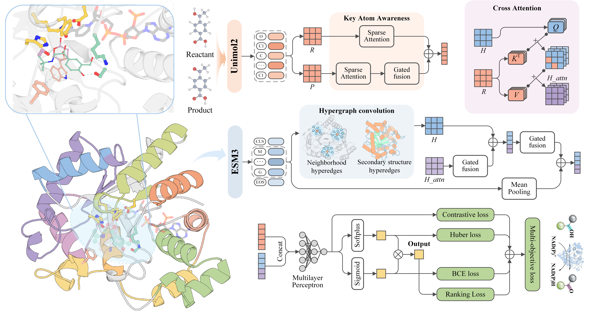

<div align="center">

# EnzySCOPE

**A substrate-first-enzymology deep-learning framework for transforming new-to-nature chemicals**




</div>

---

## Overview

**EnzySCOPE** is a substrate-first-enzymology deep-learning framework for transforming new-to-nature chemicals.

## Project Structure

```text
configs/test_case.json        Test prediction config
configs/train_config.json     Training workflow config
src/predict.py                Run test prediction
src/train.py                  Training entry point
src/model.py                  EnzySCOPE model
data/test_case/               Test data and graph files
checkpoints/                  test_seed_<seed>.pt
outputs/                      Prediction outputs
```

## Installation

Check the existing Python, PyTorch, and CUDA environment first:

```text
Python   3.10
PyTorch  2.1.2
CUDA     11.8
```

```bash
python -c "import sys, torch; print(sys.version); print(torch.__version__); print(torch.version.cuda); print(torch.cuda.is_available())"
```

Install prediction dependencies:

```bash
pip install -r requirements.txt
```

## Quick Start

Run test prediction from the project root:

```bash
python src/predict.py
```

Default behavior:

```text
config: configs/test_case.json
seeds: 1231-1240
output: outputs/
```

## Full Pipeline

```bash
python src/embed_molecules.py --molecule-csv data/train/train_molecules.csv --output-pkl data/train/train_molecule_embeddings.pkl
python src/embed_enzymes.py --enzyme-csv data/train/train_enzymes.csv --output-pt data/train/train_enzyme_embeddings.pt
python src/build_graphs.py --enzyme-csv data/train/train_enzymes.csv --structure-dir raw_structures --output-dir data/train/train_protein_graphs
python src/train.py --config configs/train_config.json --epochs 100 --seed 1234
python src/predict.py
```
